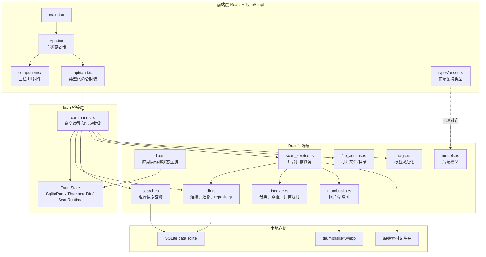
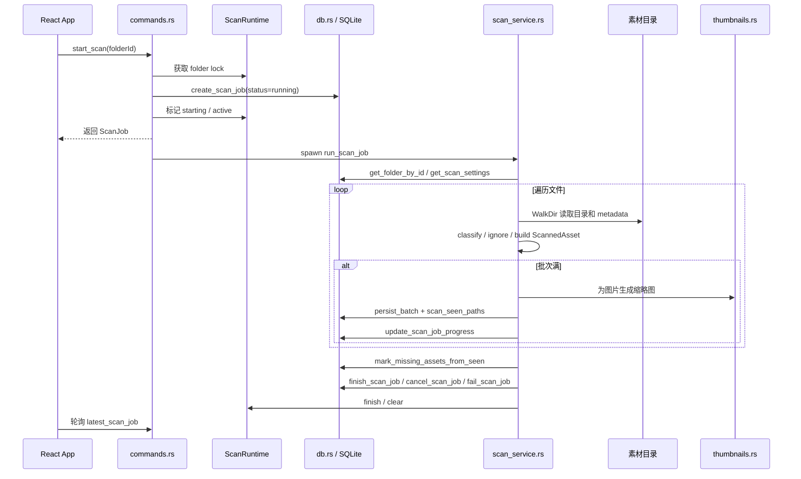

# 架构说明

## 1. 总体分层

项目采用 Tauri 2 + React + Rust + SQLite 的本地桌面分层架构。

前端不直接访问文件系统或数据库；所有本地能力通过 `src/api/tauri.ts` 调用 Tauri command。Rust 后端集中处理文件系统、数据库、扫描任务、缩略图生成和系统文件动作。

## 2. 核心模块之间的调用关系

### 启动链路

1. `src-tauri/src/main.rs` 调用 `game_resource_manager_lib::run()`。
2. `src-tauri/src/lib.rs` 创建 Tauri Builder。
3. `lib.rs` 注册 dialog/opener 插件。
4. `lib.rs` 解析应用数据目录，创建 `data.sqlite` 路径。
5. `db::connect` 打开 SQLite，执行 `src-tauri/migrations`。
6. `lib.rs` 注册 `SqlitePool`、`ThumbnailDir`、`ScanRuntime` 到 Tauri State。
7. `lib.rs` 调用 `db::ensure_app_paths` 写入数据库路径和缩略图路径。
8. `lib.rs` 后台清理旧扫描任务。
9. `lib.rs` 注册 `commands.rs` 中的 command handler。

### 前端数据加载链路

1. `App.tsx` 首次渲染后调用 `loadData`。
2. `loadData` 并行调用 `listAssets`、`listLibraryFolders`、`listAssetTags`、`listCollections`。
3. `src/api/tauri.ts` 使用 `invoke` 调用 Rust command。
4. `commands.rs` 调用 `db.rs` repository。
5. `App.tsx` 将标签映射合并到资源对象上，并保存到 React state。
6. 对每个素材文件夹调用 `latestScanJob`，用于左侧扫描按钮和中间状态条。

### 搜索链路

1. 用户输入搜索词、切换搜索域或筛选条件。
2. `App.tsx` 组装 `AssetSearchRequest`。
3. `searchAssets(req)` 调用 `search_assets` command。
4. `commands.rs` 转发给 `search::search_assets`。
5. `search.rs` 按请求动态组合 SQL 条件，使用绑定参数执行查询。
6. 前端把已有标签缓存重新合并到搜索结果并渲染网格。

### 扫描链路

扫描设计要点：

- 同一文件夹通过 `ScanRuntime.folder_lock` 串行启动。
- SQLite partial unique index 保证同一文件夹最多一个 running job。
- `ScanRuntime` 记录 active、cancelled、starting 状态，用于处理重复启动、取消和 stale running job。
- 扫描按 500 个资源一批写库，避免超大 SQL 参数和一次性事务。
- `scan_seen_paths` 暂存本次扫描见过的路径，扫描末尾用它标记缺失文件。
- 缩略图失败不会阻断资源入库，只写入 `thumbnail_status = failed` 和错误信息。
- 取消扫描时保留已经成功写入的资源索引。

### 标签、收藏、集合、备注链路

- 收藏：`AssetGrid` 或 `DetailsPanel` 调用 `setAssetFavorite`，后端更新 `assets.is_favorite`。
- 标签：`TagEditor` 提交标签名，`db::create_or_get_tag` 先 trim、压缩空白并转小写，再写 `tags` 和 `asset_tags`。
- 共同标签：多选时 `DetailsPanel` 调用 `listCommonTags`。
- 集合：左侧创建集合，右侧把选中资源加入集合，搜索时可按 `collection_id` 过滤。
- 备注：单选详情面板编辑 `note`，失焦或点击保存后调用 `updateAssetNote`。

## 3. 数据流和状态管理方式

前端状态集中在 `App.tsx`：

- `assets`：主资源列表，加载后合并标签。
- `gridAssets`：当前搜索/筛选结果。
- `folders`：素材文件夹列表。
- `collections`：集合列表。
- `selectedIds`：当前选中资源 id。
- `activeFilter`：类型/收藏/缺失筛选。
- `selectedFolderId`：当前选中文件夹筛选。
- `selectedCollectionId`：当前选中集合筛选。
- `query` 和 `scope`：搜索词和搜索域。
- `latestJobs`：每个素材文件夹最近扫描任务。
- `scanSettings`：扫描设置。
- `isScanning`、`scanMessage`、`activeJobId`：扫描体验状态。

状态更新方式以 React `useState`、`useEffect`、`useCallback` 为主，没有引入全局状态库。异步操作成功后通常采用两种策略：

- 局部乐观更新：收藏、备注等小变更直接更新 `assets` 和 `gridAssets`。
- 重新加载：标签、集合、文件夹、扫描完成后调用 `loadData` 或重新执行搜索。

后端状态分两类：

- 持久状态：SQLite 表，包括资源、文件夹、标签、集合、扫描任务、扫描设置。
- 运行时状态：Tauri State 中的 `SqlitePool`、`ThumbnailDir`、`ScanRuntime`。

## 4. 数据模型

核心表：

- `library_folders`：用户加入的素材根目录。
- `assets`：索引到的素材文件，包含路径、类型、大小、修改时间、尺寸、缩略图、备注、收藏、缺失状态。
- `tags`：标签。
- `asset_tags`：资源和标签的多对多关系。
- `collections`：用户集合。
- `collection_assets`：集合和资源的多对多关系。
- `scan_jobs`：扫描任务状态、统计、当前路径、错误信息。
- `scan_seen_paths`：扫描期间暂存本次任务见过的资源路径。
- `scan_settings`：扫描类型开关、PSD 缩略图、忽略目录、忽略扩展名、应用路径。

关键约束：

- `library_folders.path` 唯一。
- `assets.absolute_path` 唯一。
- `asset_tags(asset_id, tag_id)` 唯一。
- `collection_assets(collection_id, asset_id)` 唯一。
- `scan_jobs` 上有 partial unique index：同一 `library_folder_id` 同时只能有一个 `status = 'running'` 的任务。

## 5. 配置文件作用

- `package.json`：前端包信息、npm scripts、React/Tauri/Vite/Vitest 依赖。
- `package-lock.json`：npm 依赖锁定。
- `tsconfig.json`：TypeScript 严格编译配置，包含 `src`。
- `vite.config.ts`：React 插件、开发服务器、Vitest jsdom 和 setup file。
- `index.html`：Vite HTML 入口。
- `src-tauri/Cargo.toml`：Rust crate、Tauri 2、sqlx、image、tokio、walkdir 等依赖。
- `src-tauri/Cargo.lock`：Rust 依赖锁定。
- `src-tauri/build.rs`：Tauri build script。
- `src-tauri/tauri.conf.json`：产品名、版本、窗口、前端构建命令、asset protocol、NSIS 打包目标。
- `src-tauri/capabilities/default.json`：Tauri v2 权限，允许 core、dialog、opener。
- `src-tauri/migrations/*.sql`：SQLite schema 版本迁移。
- `src/test/setup.ts`：Vitest 加载 jest-dom matcher。
- `tests/smoke/README.md`：手动烟测清单。
- `package.ps1`：Windows 打包产物收集脚本。

## 6. 架构风险

- 资源库规模上来后，React 网格没有虚拟滚动，数据库搜索没有 FTS，2,000 条上限只是临时保护。
- 扫描和缩略图生成虽然已批处理，但仍在同一扫描流程中，后续可拆成独立缩略图队列。
- 运行时扫描状态在内存中，应用崩溃后依赖 stale job recovery 修复数据库状态；这部分逻辑复杂，需要继续用测试保护。
- 前端 `loadData` 会一次拉取资源、标签和集合；资源量大后需要分页和按需加载标签。
- 后端 repository 里有较多手写 SQL 和重复的 ScanJob 映射逻辑，后续可抽取 mapper 或使用更一致的查询结构。
- 当前“删除文件夹”是删除索引，不删除磁盘目录；UI 和文档需要持续强调，避免用户误解。
