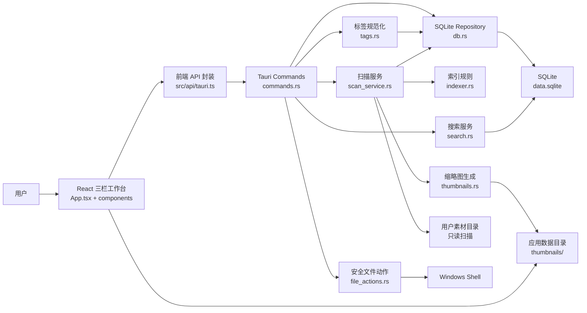

# 项目总览

## 1. 项目用途和核心功能

游戏资源管理器 / Game Resource Manager 是一个本地优先的 Windows 桌面应用，用于把多个本地游戏素材文件夹组织成可搜索、可预览、可收藏、可整理的资源库。项目边界明确：应用只管理索引、缩略图、标签、收藏、集合和备注，不接管用户原始素材目录，也不删除、移动、重命名或修改原始素材文件。

当前实现面向 MVP + 扫描稳定性增强版本，核心能力包括：

- 添加本地素材文件夹，并保存为资源库目录。
- 扫描图片、音频、视频、字体、3D、Spine 等常见素材类型。
- 为图片素材生成 WebP 缩略图，缩略图写入 Tauri 应用数据目录。
- 使用三栏工作台浏览资源：左侧筛选/文件夹/集合，中间搜索和网格，右侧详情/批量操作。
- 按文件名、标签、备注、路径搜索，并按类型、收藏、缺失状态、文件夹、集合筛选。
- 收藏/取消收藏资源。
- 给单个或多个资源添加标签。
- 创建集合，并把资源加入集合。
- 编辑单个资源备注。
- 打开文件、打开所在目录、复制绝对路径。
- 记录扫描任务状态，支持扫描进度、取消扫描、增量扫描和缺失文件标记。
- 提供扫描设置：类型开关、PSD 缩略图开关、忽略目录、忽略扩展名，以及数据库/缩略图缓存路径展示。

当前项目不是 Godot 项目，也没有 SVN、AI 自动打标、删除、批量移动、批量重命名、图集处理或完整 3D/Spine 运行时预览。

## 2. 技术栈和主要依赖

### 前端

- React 18：桌面 UI、状态组织、组件渲染。
- TypeScript：前端领域类型和 API 参数类型。
- Vite：开发服务器与前端构建。
- @tauri-apps/api：从前端调用 Tauri command，转换本地文件路径为可显示资源 URL。
- lucide-react：图标依赖，目前代码中主要仍使用文本按钮/符号。
- clsx：样式类名工具依赖，目前使用较少。
- Vitest + Testing Library + jsdom：组件测试环境。

### 后端

- Tauri 2：Windows 桌面壳、命令桥、插件和应用数据目录。
- Rust：本地能力、扫描、数据库、缩略图和系统文件动作。
- SQLite + sqlx：本地数据库、migration、repository。
- tokio：异步 runtime、后台扫描任务、取消状态管理。
- walkdir：目录遍历。
- image：图片解码、缩略图生成、WebP 输出。
- sha1：缩略图缓存文件名哈希。
- open：调用系统默认方式打开文件或目录。
- anyhow / thiserror：错误处理。
- tauri-plugin-dialog：目录选择。
- tauri-plugin-opener：Tauri opener 权限插件。

## 3. 构建流程

常用命令在项目根目录 `I:\GameResManger` 执行：

```powershell
npm test
npm run build
npm run dev
npm run tauri dev
```

构建流程如下：

1. `npm run build` 执行 `tsc && vite build`，先做 TypeScript 检查，再生成前端 `dist/`。
2. `npm run tauri dev` 通过 Tauri CLI 启动桌面开发模式，`src-tauri/tauri.conf.json` 会先运行 `npm run dev`，再加载 `http://localhost:1420`。
3. `npx tauri build` 会先按配置运行 `npm run build`，再编译 Rust 后端并打包桌面应用。
4. `package.ps1` 是项目打包脚本：检查 npm/cargo/rustc，执行前端构建和 Tauri 构建，再把 NSIS 安装包和便携 exe 收集到 `releases/v版本-时间戳/`。

后端验证在 `I:\GameResManger\src-tauri` 执行：

```powershell
cargo test
cargo check
```

Windows 上 Rust 编译依赖本机 MSVC 和 Windows SDK。如果出现 `stdarg.h`、`excpt.h`、`msvcrt.lib` 等错误，优先判断为本机环境问题。

## 4. 运行入口

前端入口：

- `index.html` 挂载 `<div id="root"></div>`。
- `src/main.tsx` 创建 React root，渲染 `App`，并加载 `src/styles.css`。
- `src/App.tsx` 是三栏工作台的主状态容器。

后端入口：

- `src-tauri/src/main.rs` 调用 `game_resource_manager_lib::run()`。
- `src-tauri/src/lib.rs` 创建 Tauri Builder，注册插件、数据库连接池、缩略图目录、扫描运行时和所有 command。
- `src-tauri/tauri.conf.json` 定义产品名、版本、窗口、构建命令、资源协议和 NSIS bundle。

## 5. 当前已知状态

- `git status --short` 显示项目已有大量未提交/未跟踪改动，包含前后端实现、README、打包脚本、release 产物和新增组件。
- 当前分析没有修改任何现有源码文件。
- 现有 README 记录预期：`npm test` 20+ 测试，`npm run build` 成功；`cargo test` 57+ 测试需本机 MSVC/Windows SDK 配置正确。

## 6. 潜在风险和技术债务

- 前端结果上限为 2,000 条，超大资源库后续需要分页、虚拟列表和 SQLite FTS。
- 缩略图生成仍发生在扫描批次流程中，虽然已批量和异步化，但大图片目录仍可能拖慢扫描。
- 每批缩略图会对批次内可生成缩略图的文件创建 tokio 任务，极大批量或慢磁盘下可能需要并发限流。
- 搜索基于 `LIKE` 和动态 SQL 条件组合，数据量增大后性能和排序能力有限。
- `update_scan_job_progress` 当前 SQL 只对 `current_path` 做运行态保护，计数仍可能被旧 worker 更新到非 running 任务上，和注释/历史意图存在偏差风险。
- `delete_library_folder` 删除的是库目录索引并通过级联删除相关索引数据，虽然不触碰源文件，但 UI 文案“删除文件夹及其所有资源”容易让用户误解为删除磁盘文件。
- 标签标准化会统一转小写，这对英文去重友好，但对大小写敏感的命名习惯不可逆。
- 集合目前支持创建、加入、移出关系，但前端缺少完整集合重命名、删除、详情管理。
- `asset_thumbnail_url` command 存在，但前端网格主要直接使用 `thumbnail_path + convertFileSrc`，两套缩略图访问路径可能形成冗余。
- `asset_thumbnail_url` 只返回本地路径，不使用 Tauri `asset://` URL；实际展示依赖前端转换。
- `normalize_path` 不做 canonicalize，避免不存在路径失败，但同一路径大小写、符号链接、短路径等情况可能导致重复或不一致。
- `open::that(parent)` 只能打开所在目录，不保证在资源管理器中选中具体文件。
- 配置里启用了 asset protocol scope，但前端直接使用 `convertFileSrc`，需要持续确认打包后资源协议和权限覆盖缩略图目录。
- release 目录已存在打包产物，后续打包脚本虽然避免递归删除，但旧产物匹配和版本名仍需要发布前人工复核。

## 7. 项目架构图


