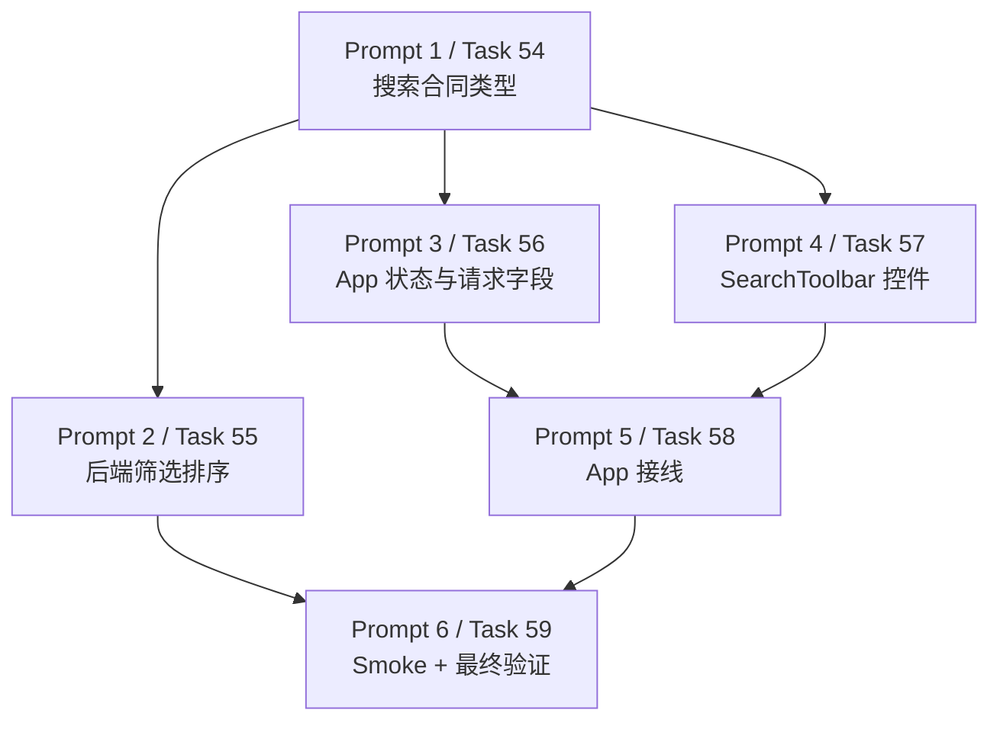

# v0.5 Advanced Filters And Sorting Agent Prompts

用途：把 `2026-06-08-advanced-filters-and-sorting.md` 拆成可直接交给其他 agent 执行的独立提示词。

通用约束：

- 默认工作目录是 `I:\GameResManger`。
- 回复用户使用中文。
- 开始前先读：
  - `I:\GameResManger\AGENTS.md`
  - `I:\GameResManger\docs\superpowers\plans\2026-06-08-advanced-filters-and-sorting.md`
  - `G:\oklai999的策划仓库\游戏资源管理器\需求整理_v0.1.md`
- 运行 `git status --short`，只处理本任务相关文件。
- 不要删除、移动、重命名、修改原始素材文件。
- 不要向源素材目录写缓存、数据库、元数据或生成文件。
- 不要添加删除、批量移动、批量重命名、AI 自动打标、图集导出、云同步或完整运行时预览。
- 禁止批量删除命令：`del /s`、`rd /s`、`rmdir /s`、`Remove-Item -Recurse`、`rm -rf`。
- 工作区已有历史删除项、release 目录和未跟踪文件；不要回滚、清理、暂存这些无关改动。

---

## Prompt 1: Task 54 - 扩展搜索合同类型

```text
你是 Codex 子代理，请执行 `I:\GameResManger\docs\superpowers\plans\2026-06-08-advanced-filters-and-sorting.md` 中的 Task 54。

目标：
扩展前后端 AssetSearchRequest 合同，让后续可以支持文件大小、尺寸、修改时间范围筛选和排序字段/方向。此任务只改类型和测试 helper，不实现 SQL 过滤，不改 UI。

必须先读：
- `I:\GameResManger\AGENTS.md`
- `I:\GameResManger\docs\superpowers\plans\2026-06-08-advanced-filters-and-sorting.md`
- `I:\GameResManger\src-tauri\src\models.rs`
- `I:\GameResManger\src-tauri\src\search.rs`
- `I:\GameResManger\src\types\asset.ts`

只允许修改：
- `I:\GameResManger\src-tauri\src\models.rs`
- `I:\GameResManger\src-tauri\src\search.rs`
- `I:\GameResManger\src\types\asset.ts`

执行步骤：
1. 在 `I:\GameResManger` 运行 `git status --short`，记录但不要处理无关改动。
2. 在 Rust `AssetSearchRequest` 中新增字段：
   - `min_file_size: Option<i64>`
   - `max_file_size: Option<i64>`
   - `min_width: Option<i64>`
   - `max_width: Option<i64>`
   - `min_height: Option<i64>`
   - `max_height: Option<i64>`
   - `modified_after: Option<String>`
   - `modified_before: Option<String>`
   - `sort_by: String`
   - `sort_direction: String`
3. 在 TypeScript 中新增：
   - `AssetSortBy = "file_name" | "file_size" | "modified_at" | "asset_type"`
   - `SortDirection = "asc" | "desc"`
   - `AssetSearchFilters`
   - `AssetSearchSort`
   - 并让 `AssetSearchRequest` 镜像 Rust 新字段。
4. 更新 `src-tauri/src/search.rs` 中 `empty_request()`，给所有新增字段设置默认值：
   - range 字段为 `None`
   - `sort_by: "file_name".to_string()`
   - `sort_direction: "asc".to_string()`
5. 运行：
   `cd I:\GameResManger\src-tauri`
   `cargo check`
   `cd I:\GameResManger`
   `npm run build`
6. 如果检查失败只因为 `App.tsx` 或其他请求构造点缺少新字段，记录失败原因并说明需要 Task 56/58 衔接；不要扩大范围去改 UI。

禁止事项：
- 不要实现 `search.rs` 的 SQL 条件或排序逻辑，那属于 Task 55。
- 不要修改 `SearchToolbar.tsx` 或 `App.tsx`，除非编译错误直接要求且用户允许扩大范围。
- 不要提交，除非用户明确要求。
- 不要处理无关 dirty worktree 项。

完成后回复：
- 修改文件路径。
- 新增字段摘要。
- `cargo check` 和 `npm run build` 结果；若失败，说明是否为后续任务预期衔接失败。
- 明确说明未触碰源素材、未实现危险能力。
```

---

## Prompt 2: Task 55 - 实现后端范围筛选和安全排序

```text
你是 Codex 子代理，请执行 `I:\GameResManger\docs\superpowers\plans\2026-06-08-advanced-filters-and-sorting.md` 中的 Task 55。

目标：
在 Rust 后端 `search_assets` 中实现文件大小、宽高、修改时间范围筛选，以及白名单排序。所有用户输入值必须用 sqlx bind 参数；排序字段和方向必须白名单映射，不能拼接任意用户字符串。

前置条件：
Task 54 的 `AssetSearchRequest` 新字段已经存在。如果不存在，停止并说明缺少前置任务。

必须先读：
- `I:\GameResManger\AGENTS.md`
- `I:\GameResManger\docs\superpowers\plans\2026-06-08-advanced-filters-and-sorting.md`
- `I:\GameResManger\src-tauri\src\search.rs`
- `I:\GameResManger\src-tauri\src\models.rs`

只允许修改：
- `I:\GameResManger\src-tauri\src\search.rs`
- 如编译需要补齐类型字段，允许修改 `I:\GameResManger\src-tauri\src\models.rs`

执行步骤：
1. 在 `I:\GameResManger` 运行 `git status --short`，记录但不要处理无关改动。
2. 添加测试 helper `search_test_pool()`，创建内存 SQLite 的 `assets`、`tags`、`asset_tags`、`collection_assets` 表，并插入 `small.png`、`mid.png`、`large.png` 三条不同大小/尺寸/修改时间的测试数据。
3. 新增测试：
   - `filters_by_file_size_dimensions_and_modified_time`
   - `sorts_by_size_descending`
   - `invalid_sort_values_fall_back_to_file_name_ascending`
4. 运行 `cd I:\GameResManger\src-tauri` 后执行：
   `cargo test search::tests`
   预期：在实现前失败。
5. 在 `search_assets` 中新增条件：
   - `file_size >= ?`
   - `file_size <= ?`
   - `width >= ?`
   - `width <= ?`
   - `height >= ?`
   - `height <= ?`
   - `modified_at >= ?`
   - `modified_at <= ?`
6. 在参数绑定处按条件顺序 bind 对应值。
7. 将固定 `ORDER BY file_name` 替换为白名单排序：
   - `file_name`
   - `file_size`
   - `modified_at`
   - `asset_type`
   - 方向只允许 `ASC` 或 `DESC`，非法方向回退 `ASC`。
8. 确保所有旧 `AssetSearchRequest` 字面量补齐新增字段。
9. 运行：
   `cargo test search`
   `cargo check`

禁止事项：
- 不要修改前端 UI。
- 不要把用户传入的 `sort_by` 或 `sort_direction` 直接拼进 SQL。
- 不要删除、移动、重命名、修改源素材。
- 不要提交，除非用户明确要求。

完成后回复：
- 修改文件路径。
- 新增测试名。
- `cargo test search` 和 `cargo check` 结果。
- 明确说明排序使用白名单，筛选值使用 bind 参数。
```

---

## Prompt 3: Task 56 - 添加前端筛选/排序状态并构造请求

```text
你是 Codex 子代理，请执行 `I:\GameResManger\docs\superpowers\plans\2026-06-08-advanced-filters-and-sorting.md` 中的 Task 56。

目标：
在前端添加高级筛选和排序状态，并让 `executeSearch` 构造完整的 `AssetSearchRequest`。此任务不负责渲染 SearchToolbar 新控件，只准备状态和请求字段。

前置条件：
Task 54 已经在 `src/types/asset.ts` 中添加 `AssetSearchFilters`、`AssetSearchSort` 和扩展后的 `AssetSearchRequest`。如果不存在，停止并说明缺少前置任务。

必须先读：
- `I:\GameResManger\AGENTS.md`
- `I:\GameResManger\docs\superpowers\plans\2026-06-08-advanced-filters-and-sorting.md`
- `I:\GameResManger\src\App.tsx`
- `I:\GameResManger\src\types\asset.ts`

只允许修改：
- `I:\GameResManger\src\App.tsx`
- 如类型缺漏，允许修改 `I:\GameResManger\src\types\asset.ts`

执行步骤：
1. 在 `I:\GameResManger` 运行 `git status --short`，记录但不要处理无关改动。
2. 在 `App.tsx` 类型 import 中加入 `AssetSearchFilters` 和 `AssetSearchSort`。
3. 在 `SEARCH_RESULT_LIMIT` 附近新增：
   - `DEFAULT_SEARCH_FILTERS`
   - `DEFAULT_SEARCH_SORT`
4. 在 `AppInner` 中新增 state：
   - `filters`
   - `sort`
5. 在 `executeSearch` 的 `req` 中加入：
   - `min_file_size`
   - `max_file_size`
   - `min_width`
   - `max_width`
   - `min_height`
   - `max_height`
   - `modified_after`
   - `modified_before`
   - `sort_by`
   - `sort_direction`
6. 把 `filters` 和 `sort` 加入 `executeSearch` 的 dependency list。
7. 新增 `handleFiltersChange` 和 `handleSortChange`，更新对应 state 并清空 `selectedIds`。
8. 运行：
   `npm run build`
9. 如果 build 失败只因为 `SearchToolbar` 还不接受新 props，记录这是 Task 57 的预期衔接；不要在本任务实现 UI。

禁止事项：
- 不要修改 Rust 后端。
- 不要渲染筛选控件。
- 不要提交，除非用户明确要求。
- 不要触碰源素材或无关 dirty worktree 项。

完成后回复：
- 修改文件路径。
- 新增 state 和请求字段摘要。
- `npm run build` 结果；如失败，说明是否为 Task 57 前置衔接问题。
```

---

## Prompt 4: Task 57 - 添加 SearchToolbar 筛选和排序控件

```text
你是 Codex 子代理，请执行 `I:\GameResManger\docs\superpowers\plans\2026-06-08-advanced-filters-and-sorting.md` 中的 Task 57。

目标：
在 `SearchToolbar` 中添加紧凑的高级筛选和排序控件，覆盖文件大小 KB、宽高、修改日期范围、排序字段、排序方向和重置按钮，并补充组件测试。

前置条件：
Task 54 已添加前端类型；Task 56 已准备 App 状态更好，但本任务可以先只让组件和测试通过。

必须先读：
- `I:\GameResManger\AGENTS.md`
- `I:\GameResManger\docs\superpowers\plans\2026-06-08-advanced-filters-and-sorting.md`
- `I:\GameResManger\src\components\SearchToolbar.tsx`
- `I:\GameResManger\src\components\SearchToolbar.test.tsx`
- `I:\GameResManger\src\styles.css`
- `I:\GameResManger\src\types\asset.ts`

只允许修改：
- `I:\GameResManger\src\components\SearchToolbar.tsx`
- `I:\GameResManger\src\components\SearchToolbar.test.tsx`
- `I:\GameResManger\src\styles.css`

执行步骤：
1. 在 `I:\GameResManger` 运行 `git status --short`，记录但不要处理无关改动。
2. 更新 `SearchToolbar` props，新增：
   - `filters`
   - `sort`
   - `onFiltersChange`
   - `onSortChange`
3. 添加 helper：
   - `parseNumber`
   - `updateNumberFilter`
   - `updateKilobyteFilter`
   - `updateDateFilter`
   - `dateInputValue`
   - `resetAdvancedFilters`
4. 在测试中导入 `fireEvent`，添加默认 `filters` 和 `sort`。
5. 新增测试：
   - `updates file size filters`
   - `updates sort controls`
   - `resets advanced filters`
6. 先运行：
   `npm test -- src/components/SearchToolbar.test.tsx`
   预期：实现控件前失败。
7. 在 `SearchToolbar.tsx` 渲染 `.advanced-filter-row`，包含：
   - `最小大小 KB`
   - `最大大小 KB`
   - `最小宽度`
   - `最小高度`
   - `修改日期从`
   - `修改日期到`
   - `排序字段`
   - `排序方向`
   - `重置高级筛选`
8. 在 `styles.css` 添加紧凑工具型样式：
   - `.search-toolbar { flex-wrap: wrap; }`
   - `.advanced-filter-row`
   - `.advanced-filter-row label`
   - `.advanced-filter-row input, .advanced-filter-row select`
   - `.icon-text-btn`
9. 运行：
   `npm test -- src/components/SearchToolbar.test.tsx`
   `npm run build`

禁止事项：
- 不要做营销式/落地页式 UI。
- 不要修改 Rust 后端。
- 不要修改文件动作或危险能力。
- 不要提交，除非用户明确要求。

完成后回复：
- 修改文件路径。
- 新增控件和测试摘要。
- `npm test -- src/components/SearchToolbar.test.tsx` 与 `npm run build` 结果。
```

---

## Prompt 5: Task 58 - 将筛选和排序接入 App 搜索

```text
你是 Codex 子代理，请执行 `I:\GameResManger\docs\superpowers\plans\2026-06-08-advanced-filters-and-sorting.md` 中的 Task 58。

目标：
把 App 中的高级筛选/排序状态传给 `SearchToolbar`，并确认 `searchAssets` 请求带上所有新字段。

前置条件：
Task 54/56/57 已完成或至少类型与组件 props 已存在。如果 `SearchToolbar` props 或 `AssetSearchRequest` 字段不存在，停止并说明缺少前置任务。

必须先读：
- `I:\GameResManger\AGENTS.md`
- `I:\GameResManger\docs\superpowers\plans\2026-06-08-advanced-filters-and-sorting.md`
- `I:\GameResManger\src\App.tsx`
- `I:\GameResManger\src\components\SearchToolbar.tsx`
- `I:\GameResManger\src\types\asset.ts`

只允许修改：
- `I:\GameResManger\src\App.tsx`
- 如类型 import 缺漏，允许修改 `I:\GameResManger\src\types\asset.ts`

执行步骤：
1. 在 `I:\GameResManger` 运行 `git status --short`，记录但不要处理无关改动。
2. 将 `SearchToolbar` 调用替换为传入：
   - `filters={filters}`
   - `sort={sort}`
   - `onFiltersChange={handleFiltersChange}`
   - `onSortChange={handleSortChange}`
3. 确认 `executeSearch` 请求中包含所有新增字段：
   - `min_file_size`
   - `max_file_size`
   - `min_width`
   - `max_width`
   - `min_height`
   - `max_height`
   - `modified_after`
   - `modified_before`
   - `sort_by`
   - `sort_direction`
4. 更新空状态检测，确保高级筛选时无结果仍显示 no-results，而不是 no-assets。
5. 运行：
   `npm test`
   `npm run build`

禁止事项：
- 不要修改 Rust 后端。
- 不要修改 `SearchToolbar` 控件实现，除非只是修正 props 对接的小编译错误。
- 不要提交，除非用户明确要求。
- 不要处理无关 dirty worktree 项。

完成后回复：
- 修改文件路径。
- App 接线摘要。
- `npm test` 和 `npm run build` 结果。
```

---

## Prompt 6: Task 59 - 添加 Smoke QA 并做最终验证

```text
你是 Codex 子代理，请执行 `I:\GameResManger\docs\superpowers\plans\2026-06-08-advanced-filters-and-sorting.md` 中的 Task 59。

目标：
为高级筛选和排序添加手动烟测清单，并运行最终自动化验证，确认 v0.5 改动没有破坏前后端。

前置条件：
Task 54-58 已完成。若代码尚未实现，不要伪造验证；停止并说明缺少前置任务。

必须先读：
- `I:\GameResManger\AGENTS.md`
- `I:\GameResManger\docs\superpowers\plans\2026-06-08-advanced-filters-and-sorting.md`
- `I:\GameResManger\tests\smoke\README.md`

只允许修改：
- `I:\GameResManger\tests\smoke\README.md`

执行步骤：
1. 在 `I:\GameResManger` 运行 `git status --short`，记录但不要处理无关改动。
2. 在 `tests/smoke/README.md` 末尾追加：

```markdown
---

## Advanced Filters And Sorting Smoke Test

- Scan or choose a library containing at least three assets with different file sizes.
- Set a minimum file size and confirm smaller assets disappear from the grid.
- Set a maximum file size and confirm larger assets disappear from the grid.
- Use width or height filters on image assets and confirm assets without matching dimensions are hidden.
- Set a modified-date range and confirm only assets inside the range remain visible.
- Sort by name ascending and confirm card order follows file name.
- Sort by size descending and confirm larger files appear before smaller files.
- Sort by modified time descending and confirm recently modified files appear first.
- Clear advanced filters and confirm the full filtered result set returns.
- Confirm no source file is deleted, moved, renamed, modified, or written to during this smoke test.
```

3. 运行：
   `npm test`
   `npm run build`
4. 在 `I:\GameResManger\src-tauri` 运行：
   `cargo test`
   `cargo check`
5. 运行：
   `git status --short`
6. 确认变更范围只包含本阶段相关文件，加上已有无关 dirty 项；不要暂存或清理无关项。

禁止事项：
- 不要运行 GUI 烟测，除非用户明确要求。
- 不要提交，除非用户明确要求。
- 不要声称测试通过，除非你实际运行并看到通过输出。
- 不要处理无关 release 文件、历史删除项或未跟踪文件。
- 不要触碰源素材。

完成后回复：
- 修改文件路径。
- `npm test` 结果。
- `npm run build` 结果。
- `cargo test` 结果。
- `cargo check` 结果。
- 工作区状态摘要。
- 明确说明未触碰源素材、未添加危险能力。
```

---

## 推荐分发顺序

1. Prompt 1 先执行，扩展搜索合同。
2. Prompt 2 可在 Prompt 1 后执行，完成后端搜索能力。
3. Prompt 3 和 Prompt 4 在 Prompt 1 后可以并行执行，但 Prompt 5 要等它们都完成。
4. Prompt 5 负责最终前端接线。
5. Prompt 6 最后执行，补 smoke QA 并做全量验证。

## 任务依赖图



## 注意

- Prompt 1 和 Prompt 3 可能出现“编译失败但属于后续任务衔接”的情况；执行者必须如实记录，不要扩大范围硬做后续任务。
- Prompt 2 的安全核心是 SQL 排序白名单，不能把用户传入字段直接拼进 SQL。
- Prompt 4 的 UI 要保持工具型、紧凑、高信息密度，不要做大卡片或营销式说明。
