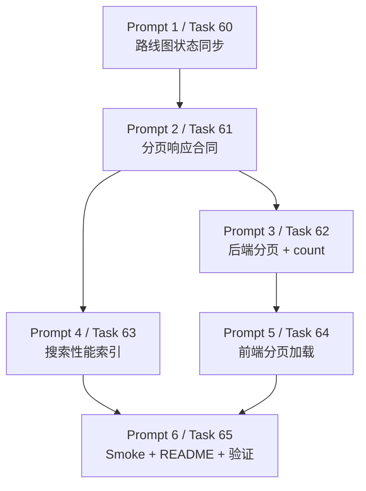

# Large Library Browsing Performance Agent Prompts

用途：把 `2026-06-08-large-library-browsing-performance.md` 拆成可直接交给其他 agent 执行的独立提示词。

通用约束：

- 默认工作目录是 `I:\GameResManger`。
- 回复用户使用中文。
- 开始前先读：
  - `I:\GameResManger\AGENTS.md`
  - `I:\GameResManger\docs\superpowers\plans\2026-06-08-large-library-browsing-performance.md`
  - `G:\oklai999的策划仓库\游戏资源管理器\需求整理_v0.1.md`
- 运行 `git status --short`，只处理本任务相关文件。
- 不要删除、移动、重命名、修改原始素材文件。
- 不要向源素材目录写缓存、数据库、元数据或生成文件。
- 不要添加删除、批量移动、批量重命名、AI 自动打标、图集导出、云同步或完整运行时预览。
- 禁止批量删除命令：`del /s`、`rd /s`、`rmdir /s`、`Remove-Item -Recurse`、`rm -rf`。
- 不要提交，除非用户明确要求。
- 不要处理无关 dirty worktree 项。

---

## Prompt 1: Task 60 - 同步当前路线图状态

```text
你是 Codex 子代理，请执行 `I:\GameResManger\docs\superpowers\plans\2026-06-08-large-library-browsing-performance.md` 中的 Task 60。

目标：
确认当前代码已经包含高级筛选/排序能力，并把旧计划板和里程碑记录同步到真实状态。此任务只做文档状态同步，不改业务代码。

必须先读：
- `I:\GameResManger\AGENTS.md`
- `I:\GameResManger\docs\superpowers\plans\2026-06-08-large-library-browsing-performance.md`
- `I:\GameResManger\docs\superpowers\plans\2026-06-08-advanced-filters-and-sorting.md`
- `G:\oklai999的策划仓库\游戏资源管理器\里程碑记录\2026-06-04-sharp-stock-reference-milestones.md`

只允许修改：
- `I:\GameResManger\docs\superpowers\plans\2026-06-08-advanced-filters-and-sorting.md`
- `G:\oklai999的策划仓库\游戏资源管理器\里程碑记录\2026-06-04-sharp-stock-reference-milestones.md`

执行步骤：
1. 在 `I:\GameResManger` 运行 `git status --short`，记录但不要处理无关改动。
2. 运行：
   `Select-String -Path 'I:\GameResManger\src\App.tsx','I:\GameResManger\src-tauri\src\search.rs','I:\GameResManger\src\components\SearchToolbar.tsx' -Pattern 'min_file_size|sort_by|advanced-filter-row'`
3. 确认输出显示 App、Rust search、SearchToolbar 都有高级筛选/排序字段。
4. 在 `2026-06-08-advanced-filters-and-sorting.md` 中把 Tasks 54-59 从 `[ ]` 改为 `[x]`，只在代码和 smoke 清单都已确认存在时修改。
5. 在里程碑记录 completion log 追加：
   `| 2026-06-08 | v0.5 Advanced Filters And Sorting | Verified | npm test; npm run build; cargo test; cargo check | Size, dimensions, modified time filters, and whitelisted sorting are implemented. |`
6. 运行 `git status --short`，确认变更范围。

禁止事项：
- 不要修改源码。
- 不要运行删除或清理命令。
- 不要伪造验证；如果没有实际运行全量验证，把 evidence 改成“code presence reviewed”，并说明还需最终验证。

完成后回复：
- 修改文件路径。
- 状态同步结果。
- `Select-String` 关键发现。
- 工作区状态摘要。
```

---

## Prompt 2: Task 61 - 添加分页搜索响应合同

```text
你是 Codex 子代理，请执行 `I:\GameResManger\docs\superpowers\plans\2026-06-08-large-library-browsing-performance.md` 中的 Task 61。

目标：
添加分页搜索响应合同 `AssetSearchResponse`，让后续后端和前端可以返回 assets、total_count、limit、offset。此任务只改模型、类型和 API wrapper，不接入 App，不实现后端查询。

必须先读：
- `I:\GameResManger\AGENTS.md`
- `I:\GameResManger\docs\superpowers\plans\2026-06-08-large-library-browsing-performance.md`
- `I:\GameResManger\src-tauri\src\models.rs`
- `I:\GameResManger\src\types\asset.ts`
- `I:\GameResManger\src\api\tauri.ts`

只允许修改：
- `I:\GameResManger\src-tauri\src\models.rs`
- `I:\GameResManger\src\types\asset.ts`
- `I:\GameResManger\src\api\tauri.ts`

执行步骤：
1. 在 `I:\GameResManger` 运行 `git status --short`，记录但不要处理无关改动。
2. 在 Rust `models.rs` 添加：
   `AssetSearchResponse { assets: Vec<Asset>, total_count: i64, limit: i64, offset: i64 }`
3. 在 TypeScript `asset.ts` 添加同名类型：
   `assets: Asset[]; total_count: number; limit: number; offset: number;`
4. 在 `src/api/tauri.ts` 导入 `AssetSearchResponse`，添加：
   `searchAssetsPage(req: AssetSearchRequest): Promise<AssetSearchResponse>`
   调用 Tauri command 名称：`search_assets_page`。
5. 运行：
   `cd I:\GameResManger\src-tauri`
   `cargo check`
   `cd I:\GameResManger`
   `npm run build`

禁止事项：
- 不要修改 `search.rs`、`commands.rs`、`lib.rs`。
- 不要把分页 API 接入 `App.tsx`。
- 不要提交，除非用户明确要求。

完成后回复：
- 修改文件路径。
- 新增合同摘要。
- `cargo check` 和 `npm run build` 结果。
- 若失败，说明是否因为后续 Task 62 尚未注册 command。
```

---

## Prompt 3: Task 62 - 实现后端 count + page 查询

```text
你是 Codex 子代理，请执行 `I:\GameResManger\docs\superpowers\plans\2026-06-08-large-library-browsing-performance.md` 中的 Task 62。

目标：
实现后端分页搜索 `search_assets_page`，返回当前页 assets 和匹配总数 total_count。count 查询必须和 row 查询使用同一套筛选条件，用户输入仍必须用 bind 参数，排序仍必须白名单。

前置条件：
Task 61 的 `AssetSearchResponse` 已存在。如果不存在，停止并说明缺少前置任务。

必须先读：
- `I:\GameResManger\AGENTS.md`
- `I:\GameResManger\docs\superpowers\plans\2026-06-08-large-library-browsing-performance.md`
- `I:\GameResManger\src-tauri\src\search.rs`
- `I:\GameResManger\src-tauri\src\commands.rs`
- `I:\GameResManger\src-tauri\src\lib.rs`
- `I:\GameResManger\src-tauri\src\models.rs`

只允许修改：
- `I:\GameResManger\src-tauri\src\search.rs`
- `I:\GameResManger\src-tauri\src\commands.rs`
- `I:\GameResManger\src-tauri\src\lib.rs`

执行步骤：
1. 在 `I:\GameResManger` 运行 `git status --short`，记录但不要处理无关改动。
2. 在 `search.rs` 测试模块新增测试：
   - `paged_search_returns_total_count`
   - `paged_search_applies_same_filters_to_count`
3. 运行：
   `cd I:\GameResManger\src-tauri`
   `cargo test search::tests::paged_search`
   预期：实现前失败。
4. 实现 `search_assets_page(db, req)`：
   - 调用或复用 row 查询得到当前页 assets。
   - 调用 `count_search_assets(db, req)` 得到总数。
   - 返回 `AssetSearchResponse { assets, total_count, limit, offset }`。
5. 实现 `count_search_assets`：
   - SQL 使用 `SELECT COUNT(*) FROM assets`。
   - 使用和 `search_assets` 相同的 WHERE 条件与 bind 顺序。
   - 不包含 `ORDER BY`、`LIMIT`、`OFFSET`。
6. 添加 Tauri command：
   `search_assets_page(db: State<'_, SqlitePool>, req: AssetSearchRequest) -> Result<AssetSearchResponse, CommandError>`
7. 在 `lib.rs` 注册 command。
8. 运行：
   `cargo test search`
   `cargo check`

禁止事项：
- 不要修改前端。
- 不要把用户传入的 sort 字段直接拼入 SQL；继续使用现有白名单逻辑。
- 不要删除或重写旧的 `search_assets` command。
- 不要提交，除非用户明确要求。

完成后回复：
- 修改文件路径。
- 新增测试名。
- `cargo test search` 和 `cargo check` 结果。
- 明确说明 count 和 row 查询筛选一致，排序白名单仍保留。
```

---

## Prompt 4: Task 63 - 添加搜索性能索引

```text
你是 Codex 子代理，请执行 `I:\GameResManger\docs\superpowers\plans\2026-06-08-large-library-browsing-performance.md` 中的 Task 63。

目标：
添加 SQLite migration，为常用大库浏览、筛选、排序路径建立索引。此任务只新增 migration，不改查询逻辑，不触碰源素材文件。

必须先读：
- `I:\GameResManger\AGENTS.md`
- `I:\GameResManger\docs\superpowers\plans\2026-06-08-large-library-browsing-performance.md`
- `I:\GameResManger\src-tauri\migrations`

只允许创建：
- `I:\GameResManger\src-tauri\migrations\0006_search_performance_indexes.sql`

执行步骤：
1. 在 `I:\GameResManger` 运行 `git status --short`，记录但不要处理无关改动。
2. 确认 `src-tauri/migrations` 中最新编号，只有在 `0006` 未被占用时创建 `0006_search_performance_indexes.sql`。
3. 写入索引：
   - `idx_assets_file_size ON assets(file_size)`
   - `idx_assets_modified_at ON assets(modified_at)`
   - `idx_assets_dimensions ON assets(width, height)`
   - `idx_assets_type_name ON assets(asset_type, file_name)`
   - `idx_assets_folder_name ON assets(library_folder_id, file_name)`
   - `idx_assets_favorite_name ON assets(is_favorite, file_name)`
   - `idx_assets_missing_name ON assets(is_missing, file_name)`
   - `idx_collection_assets_collection_asset ON collection_assets(collection_id, asset_id)`
   - `idx_asset_tags_tag_asset ON asset_tags(tag_id, asset_id)`
4. 运行：
   `cd I:\GameResManger\src-tauri`
   `cargo test`
   `cargo check`

禁止事项：
- 不要修改源码。
- 不要修改已有 migration。
- 不要写入源素材目录。
- 不要提交，除非用户明确要求。

完成后回复：
- 新增 migration 路径。
- 新增索引摘要。
- `cargo test` 和 `cargo check` 结果。
```

---

## Prompt 5: Task 64 - 将前端接入分页加载

```text
你是 Codex 子代理，请执行 `I:\GameResManger\docs\superpowers\plans\2026-06-08-large-library-browsing-performance.md` 中的 Task 64。

目标：
把前端搜索从一次性大结果窗口改为分页加载：首次搜索加载第一页，点击“加载更多”追加后续结果；当查询、筛选、排序、文件夹、集合或左侧过滤变化时重置到第一页。

前置条件：
Task 61 的 `searchAssetsPage` 前端 wrapper 已存在，Task 62 的后端 command 已注册。如果不存在，停止并说明缺少前置任务。

必须先读：
- `I:\GameResManger\AGENTS.md`
- `I:\GameResManger\docs\superpowers\plans\2026-06-08-large-library-browsing-performance.md`
- `I:\GameResManger\src\App.tsx`
- `I:\GameResManger\src\api\tauri.ts`
- `I:\GameResManger\src\components\AssetGrid.tsx`
- `I:\GameResManger\src\styles.css`

只允许修改：
- `I:\GameResManger\src\App.tsx`
- `I:\GameResManger\src\components\AssetGrid.tsx`
- `I:\GameResManger\src\styles.css`

执行步骤：
1. 在 `I:\GameResManger` 运行 `git status --short`，记录但不要处理无关改动。
2. 在 `App.tsx` 导入 `searchAssetsPage`。
3. 将单次大结果常量替换为：
   `const SEARCH_PAGE_SIZE = 200;`
4. 新增 state：
   - `totalCount`
   - `isLoadingMore`
5. 抽出构造搜索请求的 helper，例如 `buildSearchRequest(offset: number)`，确保它包含现有 query、scope、activeFilter、folder、collection、favorite、missing、recent、filters、sort 字段。
6. 修改首次搜索：调用 `searchAssetsPage({ ...req, limit: SEARCH_PAGE_SIZE, offset: 0 })`，用第一页替换 assets，并设置 `totalCount`。
7. 新增 `handleLoadMore`：
   - 如果正在加载或已显示数量 >= totalCount，直接返回。
   - 使用当前 assets.length 作为 offset。
   - 成功后 append 新页。
   - 失败时使用现有错误提示方式。
8. 在网格下方渲染 `.result-footer`：
   - 文案：`已显示 X / Y`
   - 按钮：`加载更多` / `加载中...`
9. 在 `styles.css` 添加 `.result-footer` 和按钮样式，保持工具型、紧凑。
10. 运行：
    `npm test`
    `npm run build`

禁止事项：
- 不要修改 Rust 后端。
- 不要在 `AssetGrid` 中加入文件系统或数据库逻辑。
- 不要添加无限滚动；本阶段使用显式“加载更多”。
- 不要提交，除非用户明确要求。

完成后回复：
- 修改文件路径。
- 分页接线摘要。
- `npm test` 和 `npm run build` 结果。
```

---

## Prompt 6: Task 65 - 添加烟测并做最终验证

```text
你是 Codex 子代理，请执行 `I:\GameResManger\docs\superpowers\plans\2026-06-08-large-library-browsing-performance.md` 中的 Task 65。

目标：
为大库分页浏览添加手动 smoke checklist，更新 README 当前限制，并运行最终自动化验证。此任务不再实现功能；如果前置代码未完成，停止并说明缺少 Task 61-64。

前置条件：
Task 61-64 已完成。如果 `searchAssetsPage`、后端 `search_assets_page` 或前端“加载更多”不存在，停止并说明缺少前置任务。

必须先读：
- `I:\GameResManger\AGENTS.md`
- `I:\GameResManger\docs\superpowers\plans\2026-06-08-large-library-browsing-performance.md`
- `I:\GameResManger\tests\smoke\README.md`
- `I:\GameResManger\README.md`

只允许修改：
- `I:\GameResManger\tests\smoke\README.md`
- `I:\GameResManger\README.md`

执行步骤：
1. 在 `I:\GameResManger` 运行 `git status --short`，记录但不要处理无关改动。
2. 在 `tests/smoke/README.md` 追加：
   `Large Library Pagination Smoke Test`，包含：
   - 选择超过 250 个索引资源的库。
   - 首屏不等待全部匹配项渲染。
   - footer 显示 `已显示 200 / 总数` 或当前页大小等价文案。
   - 点击 `加载更多` 会追加卡片。
   - 搜索、筛选、排序变化会重置第一页。
   - favorite、tag、collection、details、open file、open folder、copy path 仍可用。
   - 源文件未被删除、移动、重命名、修改或写入。
3. 在 `README.md` 中把：
   `Search results are capped at 2,000 rows.`
   改为：
   `Search results are loaded in pages; very large libraries may still need full grid virtualization and SQLite FTS.`
4. 运行：
   `npm test`
   `npm run build`
5. 在 `I:\GameResManger\src-tauri` 运行：
   `cargo test`
   `cargo check`
6. 运行：
   `git status --short`
7. 确认变更范围只包含本阶段相关文件，加上已有无关 dirty 项；不要暂存或清理无关项。

禁止事项：
- 不要运行 GUI smoke，除非用户明确要求。
- 不要声称测试通过，除非实际运行并看到通过输出。
- 不要提交，除非用户明确要求。
- 不要触碰源素材。

完成后回复：
- 修改文件路径。
- `npm test` 结果。
- `npm run build` 结果。
- `cargo test` 结果。
- `cargo check` 结果。
- 工作区状态摘要。
- 明确说明未触碰源素材、未添加危险能力。
```

---

## 推荐分发顺序

1. Prompt 1 先执行，收口已经完成但计划板未同步的高级筛选/排序状态。
2. Prompt 2 执行分页响应合同。
3. Prompt 3 和 Prompt 4 可在 Prompt 2 后并行执行：一个做后端分页 count，一个做索引 migration。
4. Prompt 5 等 Prompt 2 和 Prompt 3 完成后执行，接入前端分页加载。
5. Prompt 6 最后执行，补 smoke QA、README 和全量验证。

## 任务依赖图



## 注意

- Prompt 3 的关键风险是 count 查询和 row 查询条件漂移；执行者必须确认二者共享同一套筛选条件或至少同一 bind 顺序。
- Prompt 5 的关键风险是筛选变化后没有重置 offset；执行者必须覆盖 query、scope、filter、sort、folder、collection 等变化。
- Prompt 6 不能替代真实 GUI 大库 smoke；如果当前环境无法跑桌面应用，应明确标注“手动 smoke 待用户验证”。
