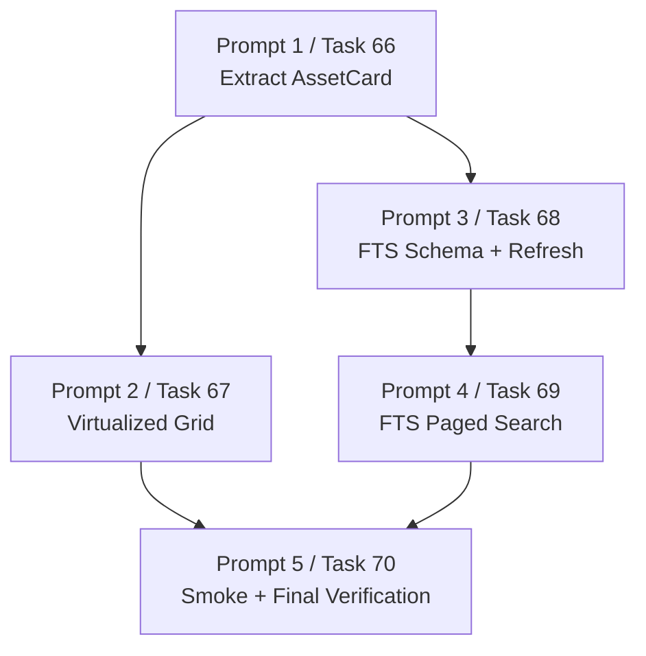

# v0.6.0 Virtualized Grid And FTS Search Agent Prompts

用途：把 `2026-06-08-v0.6-virtualized-grid-and-fts-search.md` 拆成可直接交给其他 agent 执行的独立提示词。

通用约束：

- 默认工作目录是 `I:\GameResManger`。
- 回复用户使用中文。
- 开始前先读：
  - `I:\GameResManger\AGENTS.md`
  - `I:\GameResManger\docs\superpowers\plans\2026-06-08-v0.6-virtualized-grid-and-fts-search.md`
  - `G:\oklai999的策划仓库\游戏资源管理器\需求整理_v0.1.md`
- 运行 `git status --short`，记录工作区状态，只处理本任务相关文件。
- 不要删除、移动、重命名、修改原始素材文件。
- 不要向源素材目录写入缩略图、缓存、数据库、元数据或生成文件。
- 不要添加删除源文件、批量移动、批量重命名、AI 自动打标、图集导出、云同步或完整运行时预览。
- 禁止批量删除命令：`del /s`、`rd /s`、`rmdir /s`、`Remove-Item -Recurse`、`rm -rf`。
- 不要提交，除非用户明确要求。
- 不要处理无关 dirty worktree 项。

---

## Prompt 1: Task 66 - 抽出可复用 AssetCard

```text
你是 Codex 子代理，请执行 `I:\GameResManger\docs\superpowers\plans\2026-06-08-v0.6-virtualized-grid-and-fts-search.md` 中的 Task 66。

目标：
把 `AssetGrid.tsx` 里单个资源卡片的 JSX 和辅助函数抽到 `AssetCard.tsx`，保持现有行为不变，为后续虚拟网格做准备。

必须先读：
- `I:\GameResManger\AGENTS.md`
- `I:\GameResManger\docs\superpowers\plans\2026-06-08-v0.6-virtualized-grid-and-fts-search.md`
- `I:\GameResManger\src\components\AssetGrid.tsx`
- `I:\GameResManger\src\components\AssetGrid.test.tsx`
- `I:\GameResManger\src\types\asset.ts`

只允许修改：
- `I:\GameResManger\src\components\AssetGrid.tsx`
- `I:\GameResManger\src\components\AssetGrid.test.tsx`

只允许创建：
- `I:\GameResManger\src\components\AssetCard.tsx`

执行步骤：
1. 在 `I:\GameResManger` 运行 `git status --short`，记录但不要处理无关改动。
2. 运行 `npm test -- src/components/AssetGrid.test.tsx`，确认当前测试基线。
3. 创建 `AssetCard.tsx`，从 `AssetGrid.tsx` 移入：
   - `placeholderText`
   - `assetTypeLabel`
   - `assetTypeIcon`
   - 缩略图加载失败状态
   - 卡片 JSX、checkbox、favorite 按钮、标签展示
4. `AssetCard` props 必须是：
   - `asset`
   - `selected`
   - `onSelectOnly`
   - `onToggleMulti`
   - `onToggleFavorite`
   - 可选 `style`
5. 保留现有占位文案：
   - `缺失`
   - `预览加载失败`
   - `缩略图失败`
   - `生成中`
   - `PSD`
6. 在 `AssetGrid.tsx` 中改为渲染 `AssetCard`，保留 `selectOnly` 和 `toggleMulti` 逻辑。
7. 运行：
   `npm test -- src/components/AssetGrid.test.tsx`
   `npm run build`

禁止事项：
- 不要实现虚拟滚动。
- 不要修改 Rust 后端。
- 不要改变选择、收藏、缩略图占位、标签展示行为。
- 不要提交，除非用户明确要求。

完成后回复：
- 修改/新增文件路径。
- 说明这是无行为变化重构。
- `npm test -- src/components/AssetGrid.test.tsx` 结果。
- `npm run build` 结果。
```

---

## Prompt 2: Task 67 - 实现虚拟化资源网格

```text
你是 Codex 子代理，请执行 `I:\GameResManger\docs\superpowers\plans\2026-06-08-v0.6-virtualized-grid-and-fts-search.md` 中的 Task 67。

目标：
让资源网格只渲染当前可视区域和 overscan 范围内的卡片，避免大库浏览时一次性渲染大量 DOM 节点。

前置条件：
Task 66 已完成，`I:\GameResManger\src\components\AssetCard.tsx` 已存在。如果不存在，停止并说明缺少前置任务。

必须先读：
- `I:\GameResManger\AGENTS.md`
- `I:\GameResManger\docs\superpowers\plans\2026-06-08-v0.6-virtualized-grid-and-fts-search.md`
- `I:\GameResManger\src\components\AssetGrid.tsx`
- `I:\GameResManger\src\components\AssetCard.tsx`
- `I:\GameResManger\src\components\AssetGrid.test.tsx`
- `I:\GameResManger\src\styles.css`

只允许修改：
- `I:\GameResManger\src\components\AssetGrid.tsx`
- `I:\GameResManger\src\components\AssetGrid.test.tsx`
- `I:\GameResManger\src\components\AssetCard.tsx`（仅限补 `aria-label` 或 style 支持）
- `I:\GameResManger\src\styles.css`

执行步骤：
1. 在 `I:\GameResManger` 运行 `git status --short`，记录但不要处理无关改动。
2. 在 `AssetGrid.test.tsx` 添加虚拟化测试：构造 500 个资产，mock 网格宽高，断言实际渲染的卡片少于 100 个，并且首个资产可见。
3. 先运行 `npm test -- src/components/AssetGrid.test.tsx`，预期新增测试失败。
4. 在 `AssetGrid.tsx` 添加常量：
   - `CARD_WIDTH = 176`
   - `CARD_HEIGHT = 238`
   - `GRID_GAP = 12`
   - `OVERSCAN_ROWS = 3`
5. 用 `ResizeObserver` 或等价方式测量 viewport 宽高。
6. 根据 `scrollTop`、列数、行数计算 `startIndex`、`endIndex`，只渲染可视窗口资产。
7. 用 spacer 保持总滚动高度，用 absolute/transform 定位卡片。
8. 在 `styles.css` 添加 `.asset-grid-viewport` 和 `.asset-grid-spacer`。
9. 运行：
   `npm test -- src/components/AssetGrid.test.tsx`
   `npm run build`

禁止事项：
- 不要改搜索分页逻辑。
- 不要修改 Rust 后端。
- 不要添加无限滚动。
- 不要破坏单选、checkbox 多选、收藏、缩略图占位行为。
- 不要提交，除非用户明确要求。

完成后回复：
- 修改文件路径。
- 虚拟化渲染策略摘要。
- 新增测试名。
- `npm test -- src/components/AssetGrid.test.tsx` 结果。
- `npm run build` 结果。
```

---

## Prompt 3: Task 68 - 添加 FTS schema 和文档刷新

```text
你是 Codex 子代理，请执行 `I:\GameResManger\docs\superpowers\plans\2026-06-08-v0.6-virtualized-grid-and-fts-search.md` 中的 Task 68。

目标：
新增 SQLite FTS5 表 `asset_search_fts`，并在资产索引、备注、标签变化后刷新本地搜索文档。所有 FTS 数据只写入 SQLite，不写入源素材目录。

必须先读：
- `I:\GameResManger\AGENTS.md`
- `I:\GameResManger\docs\superpowers\plans\2026-06-08-v0.6-virtualized-grid-and-fts-search.md`
- `I:\GameResManger\src-tauri\src\db.rs`
- `I:\GameResManger\src-tauri\migrations`
- `I:\GameResManger\src-tauri\src\scan_service.rs`

只允许创建：
- `I:\GameResManger\src-tauri\migrations\0007_asset_search_fts.sql`

只允许修改：
- `I:\GameResManger\src-tauri\src\db.rs`
- `I:\GameResManger\src-tauri\src\scan_service.rs`（仅当资产 upsert 刷新必须在扫描写入后调用）

执行步骤：
1. 在 `I:\GameResManger` 运行 `git status --short`，记录但不要处理无关改动。
2. 确认 migration 最新编号，只有在 `0007` 未被占用时创建 `0007_asset_search_fts.sql`。
3. migration 内容：
   `CREATE VIRTUAL TABLE IF NOT EXISTS asset_search_fts USING fts5(file_name, absolute_path, note, tags, tokenize = 'unicode61');`
4. 在 `db.rs` 添加失败测试：更新备注、应用标签、刷新 FTS 文档后，可以从 `asset_search_fts` 按 `rowid = asset.id` 读到文件名、路径、备注、标签。
5. 先运行 `cd I:\GameResManger\src-tauri; cargo test db`，预期新增测试失败。
6. 实现 `refresh_asset_search_document(pool, asset_id)`：
   - 资产不存在时删除对应 `rowid`。
   - 资产存在时读取 `file_name`、`absolute_path`、`note`。
   - 查询资产标签并用空格拼接。
   - 先删除旧 `rowid`，再插入新文档，使用 `rowid = asset.id`。
7. 在以下写入后刷新 FTS：
   - 资产 upsert/index 写入后
   - `update_asset_note`
   - `apply_tag_to_assets`
8. 运行：
   `cd I:\GameResManger\src-tauri`
   `cargo test db`
   `cargo check`

禁止事项：
- 不要实现搜索侧 FTS 查询，那是 Task 69。
- 不要写入源素材目录。
- 不要改前端。
- 不要创建普通唯一索引到 FTS 虚拟表；使用 `rowid` 作为 asset id。
- 不要提交，除非用户明确要求。

完成后回复：
- 新增 migration 路径。
- 修改文件路径。
- FTS 文档刷新触发点。
- `cargo test db` 结果。
- `cargo check` 结果。
```

---

## Prompt 4: Task 69 - 分页搜索接入 FTS

```text
你是 Codex 子代理，请执行 `I:\GameResManger\docs\superpowers\plans\2026-06-08-v0.6-virtualized-grid-and-fts-search.md` 中的 Task 69。

目标：
让 `search_assets_page` 在非空关键词搜索时使用本地 SQLite FTS，同时保持现有筛选、排序、分页、count 查询语义一致。

前置条件：
Task 68 已完成，`asset_search_fts` migration 和 `refresh_asset_search_document` 已存在。如果不存在，停止并说明缺少前置任务。

必须先读：
- `I:\GameResManger\AGENTS.md`
- `I:\GameResManger\docs\superpowers\plans\2026-06-08-v0.6-virtualized-grid-and-fts-search.md`
- `I:\GameResManger\src-tauri\src\search.rs`
- `I:\GameResManger\src-tauri\src\models.rs`
- `I:\GameResManger\src-tauri\src\db.rs`

只允许修改：
- `I:\GameResManger\src-tauri\src\search.rs`

执行步骤：
1. 在 `I:\GameResManger` 运行 `git status --short`，记录但不要处理无关改动。
2. 在 `search.rs` 添加测试：种子数据包含 FTS 文档，搜索中文标签或备注文本时，`search_assets_page` 返回正确资产和 total_count。
3. 先运行 `cd I:\GameResManger\src-tauri; cargo test search`，预期新增测试失败。
4. 添加安全 FTS query builder：
   - 拆分空白词。
   - 去除/转义双引号。
   - 每个 term 包成 quoted phrase。
   - 多 term 用 `AND`。
5. 对非空 `req.query` 使用 FTS subquery：
   `assets.id IN (SELECT rowid FROM asset_search_fts WHERE asset_search_fts MATCH ?)`
6. 保留搜索域开关：
   - `search_file_name` => `file_name`
   - `search_note` => `note`
   - `search_path` => `absolute_path`
   - `search_tags` => `tags`
7. 如果只启用部分域，构造列限定 FTS 表达式，例如 `file_name:"hero" OR tags:"hero"`。
8. 如果 query 非空但没有任何搜索域启用，返回零匹配，不要默认搜索全部字段。
9. 确保 row 查询和 count 查询使用同一套 WHERE 条件和 bind 顺序。
10. 确保排序字段仍走白名单，不允许用户输入直接拼 SQL。
11. 运行：
    `cd I:\GameResManger\src-tauri`
    `cargo test search`
    `cargo check`

禁止事项：
- 不要修改前端。
- 不要移除 `search_assets_page` 的分页/count 行为。
- 不要把用户输入直接拼进 SQL。
- 不要写源素材目录。
- 不要提交，除非用户明确要求。

完成后回复：
- 修改文件路径。
- 新增测试名。
- FTS scope 行为摘要。
- count/row 查询一致性说明。
- `cargo test search` 结果。
- `cargo check` 结果。
```

---

## Prompt 5: Task 70 - Smoke QA 与最终验证

```text
你是 Codex 子代理，请执行 `I:\GameResManger\docs\superpowers\plans\2026-06-08-v0.6-virtualized-grid-and-fts-search.md` 中的 Task 70。

目标：
为 v0.6.0 虚拟网格和 FTS 搜索补充手动 smoke checklist，更新 README 当前限制，并运行最终自动化验证。

前置条件：
Task 66-69 已完成。如果 `AssetCard.tsx`、虚拟化 `AssetGrid`、`0007_asset_search_fts.sql` 或 FTS 搜索逻辑缺失，停止并说明缺少前置任务。

必须先读：
- `I:\GameResManger\AGENTS.md`
- `I:\GameResManger\docs\superpowers\plans\2026-06-08-v0.6-virtualized-grid-and-fts-search.md`
- `I:\GameResManger\tests\smoke\README.md`
- `I:\GameResManger\README.md`

只允许修改：
- `I:\GameResManger\tests\smoke\README.md`
- `I:\GameResManger\README.md`

执行步骤：
1. 在 `I:\GameResManger` 运行 `git status --short`，记录但不要处理无关改动。
2. 确认前置代码存在：
   - `src/components/AssetCard.tsx`
   - `asset-grid-viewport`
   - `src-tauri/migrations/0007_asset_search_fts.sql`
   - `asset_search_fts` 查询逻辑
3. 在 `tests/smoke/README.md` 追加 `v0.6.0 Virtualized Grid And FTS Search Smoke Test`，包含：
   - 使用至少 2,000 个索引资源的库。
   - 网格滚动流畅，不一次渲染数千卡片。
   - 深度滚动后 selection、checkbox 多选、favorite、详情、标签、集合、打开文件、打开目录、复制路径仍可用。
   - 文件名搜索可用。
   - 备注搜索可用。
   - 标签搜索可用。
   - 类型、大小、尺寸、修改时间、收藏、缺失、文件夹、集合、排序过滤后分页总数仍合理。
   - 源文件未被删除、移动、重命名、修改或写入。
4. 在 `README.md` 中把：
   `Search results are loaded in pages; very large libraries may still need full grid virtualization and SQLite FTS.`
   改为：
   `Search results are loaded in pages and the grid is virtualized; extremely large libraries may still need additional profiling and query tuning.`
5. 运行：
   `npm test`
   `npm run build`
6. 在 `I:\GameResManger\src-tauri` 运行：
   `cargo test`
   `cargo check`
7. 运行 `git status --short`，确认变更范围。

禁止事项：
- 不要实现新功能。
- 不要运行 GUI smoke，除非用户明确要求。
- 不要声称测试通过，除非实际运行并看到通过输出。
- 不要触碰源素材。
- 不要提交，除非用户明确要求。

完成后回复：
- 修改文件路径。
- `npm test` 结果。
- `npm run build` 结果。
- `cargo test` 结果。
- `cargo check` 结果。
- 工作区状态摘要。
- 明确说明 GUI 大库 smoke 是否已执行；如果未执行，标为待用户手动验证。
```

---

## 推荐分发顺序

1. Prompt 1 先执行，抽出 `AssetCard`。
2. Prompt 2 在 Prompt 1 后执行，接入虚拟化网格。
3. Prompt 3 可在 Prompt 1 后并行执行，因为它只改后端 FTS schema 和刷新逻辑。
4. Prompt 4 必须等 Prompt 3 完成后执行。
5. Prompt 5 最后执行，补 smoke/README 并跑最终验证。

## 任务依赖图



## 注意

- Prompt 2 的关键风险是可视窗口计算后选择状态和 favorite 按钮事件被破坏。
- Prompt 3 的关键风险是 FTS 文档刷新遗漏标签或备注更新。
- Prompt 4 的关键风险是 FTS row 查询和 count 查询条件漂移，或者用户输入绕过 SQL/FTS 安全处理。
- Prompt 5 不能替代真实 GUI 大库 smoke；若未启动桌面应用，应明确标注手动验证待完成。
